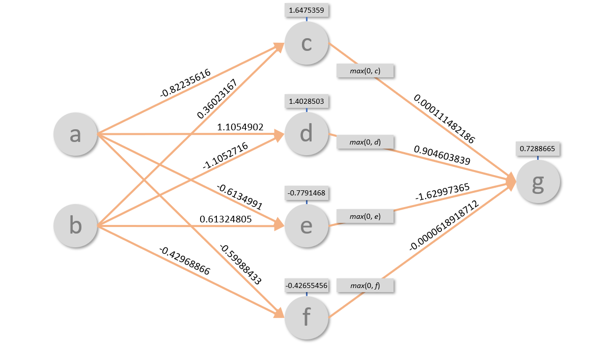

# Hands-on lab: Understanding neural networks

The diagram below depicts a trained neural network. It contains an input layer with two neurons, a hidden layer with four neurons, and an output layer with one neuron. At a high level, it takes two numeric values as input and outputs a single numeric value. The weights connecting the neurons are shown, as are the biases associated with each neuron. Your job is to figure out what the network does — in other words, to test it with input values, determine what the output values are, and quantify the relationship between input and output. In the end, the goal is to answer the following question: **What equation can be used to describe what the network does**?



To accomplish this task, you will need to create a set of sample inputs and run them through the network using the provided weights and biases. You can do this manually, *or* you can write a simple program to do it for you. Either approach requires an understanding of how neural networks work and how input values are propagated through them to produce a result.

If you decide to write a program to simulate the neural network, here are the weights and biases so you can copy and paste them:

```python
# Weights
wac = -0.82235616
wad = 1.1054902
wae = -0.6134991
waf = -0.59988433

wbc = 0.36023167
wbd = -1.1052716
wbe = 0.61324805
wbf = -0.42968866

wcg = 0.000111482186
wdg = 0.904603839
weg = -1.62997365
wfg = -0.0000618918712

# Biases
bc = 1.6475359
bd = 1.4028503
be = -0.7791468
bf = -0.42655456
bg = 0.7288665
```

If you input integer values to the network, you can safely assume that output values can be rounded to the nearest integer. For example, if you input 2 and 2 and the result is 0.00037692, you can assume that the equivalent integer output is 0.