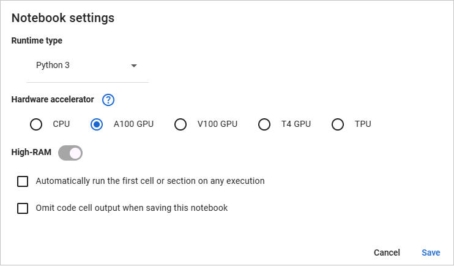

# Hands-on lab: Neural machine translation

Neural machine translation (NMT) uses deep learning to translate text from one language to another. NMT has proven superior to the [rules-based machine translation](https://en.wikipedia.org/wiki/Rule-based_machine_translation) (RBMT) and [statistical machine translation](https://en.wikipedia.org/wiki/Statistical_machine_translation) (SMT) systems that predated the explosion of deep learning and today is the basis for virtually all state-of-the-art text translation services. [Google Translate](https://translate.google.com/) uses a sophisticated NMT model trained on more than 25 billion phrase pairs to translate text between more than 100 languages.

State-of-the-art NMT models use the [transformer encoder-decoder](https://en.wikipedia.org/wiki/Transformer_(deep_learning_architecture)) architecture introduced in the landmark 2017 paper [Attention is All You Need](https://arxiv.org/abs/1706.03762). Such models are relatively easy to build with Keras and TensorFlow and a Keras add-on named [KerasNLP](https://keras.io/keras_nlp/). In this lab, you'll use these frameworks to build an NMT model that translates English to French and train it with 50,000 phrase pairs. While its accuracy won't apporach that of Google Translate, you'll find that it does a reasonable job of translating short phrases. And you'll see first-hand how transformers are coded in Python.

<a name="Exercise1"></a>
## Exercise 1: Create a Colab notebook and prepare the dataset

In this exercise, you'll load the phrase pairs and prepare them for training an NMT model. Preparation involves normalizing the text, adding special tokens marking the beginning and end of each French phrase, and tokenizing the resulting text. *Tokenization* converts words into numbers that a neural network can understand. TensorFlow's [`Tokenizer`](https://www.tensorflow.org/api_docs/python/tf/keras/preprocessing/text/Tokenizer) class uses a simple tokenization scheme that replaces each word with an integer index.

1. Begin by opening [Google Colab](https://colab.google/) in your browser and signing in with your Google account. If you don't have a Google account, you can [create one for free](https://support.google.com/accounts/answer/27441). 

1. Create a new notebook and change the name to **Neural Machine Translation.ipynb** or whatever you would like. Select **Notebook settings** from the **Edit** menu and select one of the GPU or TPU options available. (Choose **A100** if it's available. It's a high-end NVIDIA GPU.) Make sure "Runtime type" is set to **Python 3**. Then click **Save**.

    

1. Run the following command in the notebook's first cell to copy a data file named **en-fr.txt** from GitHub:

    ```
    !wget https://raw.githubusercontent.com/jeffprosise/Applied-Machine-Learning/main/Chapter%2013/Data/en-fr.txt
    ```

    This file contains 50,000 English phrases and their French equivalents. It's a subset of a larger file compiled as part of the [Tatoeba project](https://tatoeba.org/en/). The file is tab-delimited. Each line contains an English phrase, the equivalent French phrase, and an attribution identifying where the translation came from.

1. Use the following statements to load the dataset into a `DataFrame`, remove the attribution column, and shuffle and reindex the rows:

    ```python
    import pandas as pd

    df = pd.read_csv('en-fr.txt', names=['en', 'fr', 'attr'],
                     usecols=['en', 'fr'], sep='\t')
    df = df.sample(frac=1, random_state=42)
    df = df.reset_index(drop=True)
    df.head()
    ```

1. Now use the following statements to remove numbers and punctuation symbols, convert words with Unicode characters such as *où* into their ASCII equivalents (*ou*), convert characters to lowercase, and insert `[start]` and `[end]` tokens at the beginning and end of each French phrase:

    ```python
    import re
    from unicodedata import normalize

    def clean_text(text):
        text = normalize('NFD', text.lower())
        text = re.sub('[^A-Za-z ]+', '', text)
        return text

    def clean_and_prepare_text(text):
        text = '[start] ' + clean_text(text) + ' [end]'
        return text

    df['en'] = df['en'].apply(lambda row: clean_text(row))
    df['fr'] = df['fr'].apply(lambda row: clean_and_prepare_text(row))
    df.head()
    ```

1. The next step is to scan the dataset and determine the maximum length of the English phrases and the French phrases. These lengths will determine the lengths of the sequences input to and output from the model:

    ```python
    en = df['en']
    fr = df['fr']

    en_max_len = max(len(line.split()) for line in en)
    fr_max_len = max(len(line.split()) for line in fr)
    sequence_len = max(en_max_len, fr_max_len)

    print(f'Max phrase length (English): {en_max_len}')
    print(f'Max phrase length (French): {fr_max_len}')
    print(f'Sequence length: {sequence_len}')
    ```

    In this example, the longest English phrase contains seven words, while the longest French phrase contains 16 (including the `[start]` and `[end]` tokens). The model will be able to translate English phrases up to seven words in length into French phrases up to 14 words in length.

1. Now fit one `Tokenizer` to the English phrases and another `Tokenizer` to their French equivalents, and generate padded sequences from all the phrases. Note the `filters` parameter passed to the French tokenizer. It configures the tokenizer to remove all the punctuation characters it normally removes except for the square brackets used to delimit `[start]` and `[end]` tokens:

    ```python
    from tensorflow.keras.preprocessing.text import Tokenizer
    from tensorflow.keras.preprocessing.sequence import pad_sequences

    en_tokenizer = Tokenizer()
    en_tokenizer.fit_on_texts(en)
    en_sequences = en_tokenizer.texts_to_sequences(en)
    en_x = pad_sequences(en_sequences, maxlen=sequence_len, padding='post')

    fr_tokenizer = Tokenizer(filters='!"#$%&()*+,-./:;<=>?@\\^_`{|}~\t\n')
    fr_tokenizer.fit_on_texts(fr)
    fr_sequences = fr_tokenizer.texts_to_sequences(fr)
    fr_y = pad_sequences(fr_sequences, maxlen=sequence_len + 1, padding='post')
    ```

1. Next, compute the vocabulary size for each language from the `Tokenizer` instances:

    ```python
    en_vocab_size = len(en_tokenizer.word_index) + 1
    fr_vocab_size = len(fr_tokenizer.word_index) + 1

    print(f'Vocabulary size (English): {en_vocab_size}')
    print(f'Vocabulary size (French): {fr_vocab_size}')
    ```

    These values will be used to size the model's two embedding layers. The latter will also be used to size the output layer.

1. Finally, create the features and the labels the model will be trained with. The features are the padded English sequences and the padded French sequences minus the `[end]` tokens. The labels are the padded French sequences minus the `[start]` tokens:

    ```python
    inputs = [en_x, fr_y[:, :-1]]
    outputs = fr_y[:, 1:]
    ```

Now for the fun part: building and training the model.

<a name="Exercise2"></a>
## Exercise 2: Build and train a transformer-based model

In this exercise, you'll use Keras and TensorFlow to build and train a transformer-based model. The model should train in a few minutes on a GPU or TPU. It could take an hour or more on a CPU.

1. Begin by pasting the following code into the notebook's next cell. It uses Keras's [functional API](https://keras.io/guides/functional_api/) to create a neural network with two inputs: one that accepts a tokenized English phrase and another that accepts a toke⁠n­ized French phrase:

    ```python
    from tensorflow.keras import Model
    from tensorflow.keras.layers import Input, Dense, Dropout
    from keras_nlp.layers import TokenAndPositionEmbedding, TransformerEncoder
    from keras_nlp.layers import TransformerDecoder

    num_heads = 8
    embed_dim = 256

    encoder_input = Input(shape=(None,), dtype='int64', name='encoder_input')
    x = TokenAndPositionEmbedding(en_vocab_size, sequence_len,
                                  embed_dim)(encoder_input)
    encoder_output = TransformerEncoder(embed_dim, num_heads)(x)
    encoded_seq_input = Input(shape=(None, embed_dim))

    decoder_input = Input(shape=(None,), dtype='int64', name='decoder_input')
    x = TokenAndPositionEmbedding(fr_vocab_size, sequence_len, embed_dim)(decoder_input)
    x = TransformerDecoder(embed_dim, num_heads)(x, encoded_seq_input)
    x = Dropout(0.4)(x)

    decoder_output = Dense(fr_vocab_size, activation='softmax')(x)
    decoder = Model([decoder_input, encoded_seq_input], decoder_output)
    decoder_output = decoder([decoder_input, encoder_output])

    model = Model([encoder_input, decoder_input], decoder_output)
    model.compile(optimizer='adam', loss='sparse_categorical_crossentropy',
                  metrics=['accuracy'])
    model.summary()
    ```

    In this example, the encoder and decoder each comprise one layer, contain 8 attention heads, and use an embedding size of 256. To put things in perspective, ChatGPT's decoder has 96 layers with 96 attention heads each, and it uses an embedding size of 12,288.

1. Now call `fit` to train the model, and use an `EarlyStopping` callback to end training if the validation accuracy fails to improve for three consecutive epochs:

    ```python
    from tensorflow.keras.callbacks import EarlyStopping

    callback = EarlyStopping(monitor='val_accuracy', patience=3,
                             restore_best_weights=True)

    hist = model.fit(inputs, outputs, epochs=30, validation_split=0.2,
                     callbacks=[callback])
    ```

1. When training is complete, plot the per-epoch training and validation accuracy and observe how the latter steadily increases until it levels off:

    ```python
    import seaborn as sns
    import matplotlib.pyplot as plt
    %matplotlib inline
    sns.set()

    acc = hist.history['accuracy']
    val = hist.history['val_accuracy']
    epochs = range(1, len(acc) + 1)

    plt.plot(epochs, acc, '-', label='Training accuracy')
    plt.plot(epochs, val, ':', label='Validation accuracy')
    plt.title('Training and Validation Accuracy')
    plt.xlabel('Epoch')
    plt.ylabel('Accuracy')
    plt.legend(loc='lower right')
    plt.plot()
    ```

This isn't a very robust measure of accuracy because it literally compares each word in the predicted text to each word in the target text and ignores the fact that a missing or misplaced article such as le (French for the) doesn't necessarily imply a poor translation. The accuracy of NMT models is typically measured with [Bilingual Evaluation Understudy](https://en.wikipedia.org/wiki/BLEU) (BLEU) scores. BLEU scores are rather easily computed after the training is complete using packages such as [NLTK](https://www.nltk.org/), but during training, validation accuracy is a reasonable metric for judging when to halt training.

<a name="Exercise3"></a>
## Exercise 3: Use the model to translate English to French

Can the model really translate English to French? There's one way to find out.

1. Use the following code to define a function that accepts an English phrase and returns a French phrase:

    ```python
    import numpy as np

    def translate_text(text, model, en_tokenizer, fr_tokenizer, fr_index_lookup, sequence_len):
        input_sequence = en_tokenizer.texts_to_sequences([text])
        padded_input_sequence = pad_sequences(input_sequence, maxlen=sequence_len,
                                              padding='post')
        decoded_text = '[start]'

        for i in range(sequence_len):
            target_sequence = fr_tokenizer.texts_to_sequences([decoded_text])
            padded_target_sequence = pad_sequences(target_sequence,
                                                   maxlen=sequence_len,
                                                   padding='post')[:, :-1]
            
            prediction = model([padded_input_sequence, padded_target_sequence])

            idx = np.argmax(prediction[0, i, :]) - 1
            token = fr_index_lookup[idx]
            decoded_text += ' ' + token

            if token == '[end]':
                break
        
        return decoded_text[8:-6] # Remove [start] and [end] tokens
    ```

    One call to `translate_text` precipitates multiple calls to the model. To translate "hello world," for example, `translate_text` calls the model with the inputs "hello world" and "[start]." Assuming the model predicts that "salut" is the next word, `translate_text` invokes it again with the inputs "hello world" and "[start] salut." It repeats this cycle until the next word predicted by the model is "[end]" denoting the end of the translation.

1. Use the `translate_text` function to translate 10 of the phrases used to validate the model during training:

    ```python
    fr_vocab = fr_tokenizer.word_index
    fr_index_lookup = dict(zip(range(len(fr_vocab)), fr_vocab))
    texts = en[40000:40010].values

    for text in texts:
        translated = translate_text(text, model, en_tokenizer, fr_tokenizer,
                                    fr_index_lookup, sequence_len)
        print(f'{text} => {translated}')
    ```

    How well did it do? If you're not sure, use [Google Translate](https://translate.google.com/) to check the translations. They won't be perfect, but they should be close.

1. Finish up by using `translate_text` to translate "Hello world" into French:

    ```python
    translate_text('Hello world', model, en_tokenizer, fr_tokenizer,
                   fr_index_lookup, sequence_len)
    ```

The result will probably be either "bonjour" or "salut le monde." If it's something else, consider training the model again. Remember that a neural network will train differently every time, in part because Keras initializes the weights and biases with small random values.