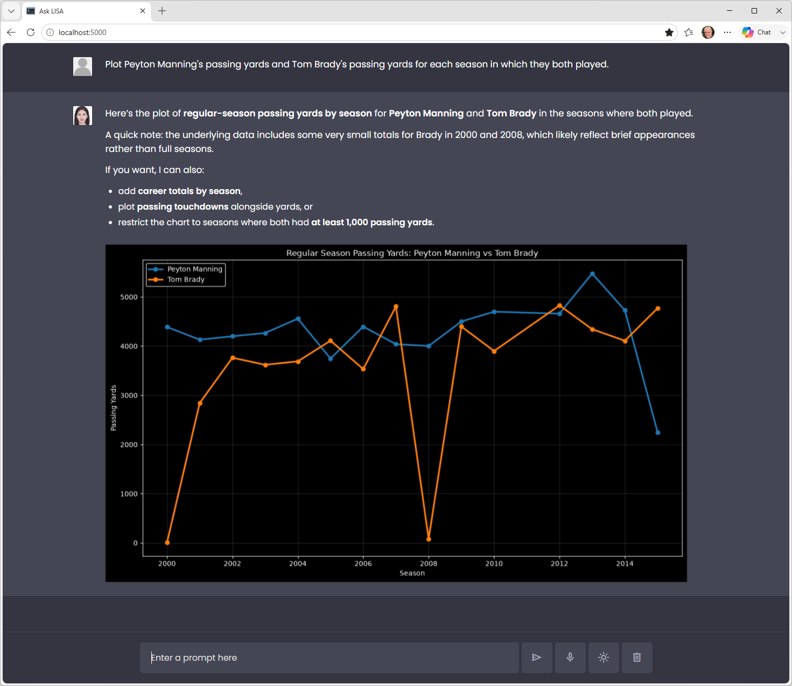

# Hands-on lab: Tool use and code generation

Imagine that you're a sports analyst who needs answers to questions such as "Which 10 NFL quarterbacks had the most passing yards in the 2020 season?" and "Which running backs had the best yards-per-carry efficiency in 2023, among those with at least 100 carries?" You have access to a CSV file from [nflverse](https://github.com/nflverse) containing player statistics for the 1999-2024 seasons, but it takes time to sift through tens of thousands of rows of data to answer such questions manually.

What if you could simply ask a question and have an answer magically appear on the screen in front of you? You've already seen examples that demonstrate how to put LLMs over databases by generating SQL, as well as examples that produce charts and graphs by generating Python code. In this lab, you'll combine [tool calling](https://platform.openai.com/docs/guides/function-calling) with code generation to put an LLM over a large CSV file containing NFL player stats. The app, called "Ask LISA" (Language-Integrated Sports Analyst) provides an easy-to-use natural-language interface over the knowledge contained in a CSV file and demonstrates yet again the power of LLM code generation.

Sound like fun? Then let's get started!



<a name="Exercise1"></a>
## Exercise 1: Start with the CodeGen Chat application

Rather than build Ask LISA from scratch, you'll start with the CodeGen Chat demo presented earlier. In this exercise, you'll make a copy of that demo and make sure it works on your computer.

1. Install the following Python packages in your environment if they aren't installed already:

	- [openai](https://pypi.org/project/openai/) for calling OpenAI APIs
	- [Flask](https://pypi.org/project/Flask/) for building Web sites
	- [llm-sandbox](https://pypi.org/project/llm-sandbox/) for running LLM-generated code in Docker containers
	- [docker](https://pypi.org/project/docker/) for interacting with Docker

1. Install [Docker](https://www.docker.com/) on your computer if it isn't installed already. Docker is required for this lab because executing LLM-generated code in Docker containers is a best practice that "sandboxes" the code and prevents it from accessing resources on the host computer.

1. Create a project directory in the location of your choice. Then copy all of the files and subdirectories in this module's "Demos/CodeGen Chat" directory to the project directory.

1. Take a moment to examine the files that you copied into the project directory. Pay particular attention to:

	- **app.py**, which contains the REST endpoints the browser client calls and the system prompt that gives the LLM the persona of a sports analyst and information about the CSV file that serves as its knowledge base.
	- **tools.py**, which contains the Python tool that the LLM uses to generate code. What is the shape of the data returned by the Python tool?

1. **Start the Docker Engine if it isn't running already**. An easy way to do that is to start Docker Desktop and look for "Engine running" in the lower-left corner.

1. Open a Command Prompt or terminal window and `cd` to the project directory. If you're running Windows, use the following command to make your OpenAI API key available through an environment variable:

	```bash
	set OPENAI_API_KEY=key
	```

	For Linux or macOS, use this command instead:

	```bash
	export OPENAI_API_KEY=key
	```

	In either case, replace *key* with your OpenAI API key.

1. Now use the following command to start Flask:

	```bash
	flask run --debug
	```

1. Watch the Command Prompt or terminal window and make sure the app starts without errors. Then open a browser and go to http://localhost:5000/. Type the following prompt into the input field at the bottom of the page:

	```
	Which 10 EU countries had the highest GDPs in 2025? Chart the results.
	```

	Then press **Enter** or click the **Send** button to the right of the input field.
	
Confirm that an answer appears after a few seconds, along with a chart visualizing the results.

<a name="Exercise2"></a>
## Exercise 2: Modify the code

The changes needed to convert the CodeGen Chat demo into Ask LISA are relatively minor. We'll add the CSV that serves as LISA's knowledge base, add code to copy it into the container where code generated by the LLM executes, and update the system prompt. We'll also add [scikit-learn](https://scikit-learn.org/stable/) to the list of packages available in the container in case LISA needs to employ machine-learning algorithms or even build and train models.

1. Create a subdirectory named "data" in the project directory. Then copy the **nfl_player_weekly_stats_1999_2024.csv** file in the lab solution's "data" directory to that directory.

	Take a moment to inspect the contents of the CSV. How many rows and columns does it contain? If you wanted to compute Peyton Manning's pass-completion percentage in the 2000 season, which column or columns would you use?

1. Open **index.html** in the "templates" subdirectory and change the page title to "Ask LISA:"

	```html
	<title>Ask LISA</title>
	```

1. Open **script.js** in the "static" subdirectory and change the page greeting to "Ask LISA:"

	```javascript
	const defaultText = `<div class="default-text">
	                        <h1>Ask LISA</h1>
	                        <p>I'm LISA, your Language-Integrated Sports Analyst.<br />How can I help you today?</p>
	                     </div>`;
	```

1. Open **tools.py** in the project directory and add the following variable declarations near the top:

	```python
	CSV_FILE_NAME='nfl_player_weekly_stats_1999_2024.csv'
	LOCAL_DATA_PATH = Path(__file__).resolve().parent / 'data' / CSV_FILE_NAME
	SANDBOX_DATA_PATH = f'/sandbox/{CSV_FILE_NAME}'
	```

	`LOCAL_DATA_PATH` now contains the full qualified path to the CSV file in the local file system, while `SANDBOX_DATA_PATH` designates the path it will be copied to in the sandbox.

1. Add `scikit-learn` to the list of packages required in the Docker container that's used to sandbox LLM-generated code:

	```python
	_pool = create_pool_manager(
		backend='docker',
		config=PoolConfig(max_pool_size=3, min_pool_size=1),
		libraries=['matplotlib', 'pandas', 'numpy', 'scikit-learn'],
		lang='python'
	)
	```

1. Delete (or comment out) the `web_search` function and the associated tool description. Also remove `search_tool` from the `tools` variable at the bottom of the file and the `import DDGS` statement at the top.

	> This removes the search tool from the list of tools available to the LLM. If you *want* LISA to have the ability to search the Web for answers, feel free to leave this code in. It doesn't hurt anything, but if you find LISA using Web search to answer questions that could be answered from the CSV file, you might have to modify the system prompt to make sure she consults the CSV file first.

1. Replace the `code_executor` function with this one:

	```python
	def code_executor(user_input, image_dir):
	    file_id = str(uuid.uuid4())
	    filename = f'{file_id}.png'
	    sandbox_image_path = f'/sandbox/{filename}'
	    image_dir = Path(image_dir)
	    local_path = image_dir / filename

	    code = generate_code(user_input, SANDBOX_DATA_PATH, sandbox_image_path)
	    image_file_id = None

	    with SandboxSession(pool=_pool, lang='python') as session:
	        session.copy_to_runtime(str(LOCAL_DATA_PATH), SANDBOX_DATA_PATH)
	        result = session.run(code)

	        try:
	            session.copy_from_runtime(sandbox_image_path, str(local_path))
	            if local_path.is_file() and local_path.stat().st_size > 0:
	                image_file_id = file_id

	        except Exception:
	            if local_path.is_file():
	                local_path.unlink(missing_ok=True)

	        payload = {
	            'stdout': result.stdout or result.stderr or '',
	            'image_file_id': image_file_id,
	            'python_code': code
	        }

	        return json.dumps(payload)
	```

	This one is almost identical to the original. It adds a parameter to the call to `generate_code` specifying the path to the CSV file in the sandbox, and it adds a call to `copy_to_runtime` to copy the CSV file from the local file system into the sandbox. The code generated by the Python tool executes in that sandbox, so any data files that it uses need to be copied into the sandbox as well.

1. Change the definition of the `generate_code` function so it accepts an extra parameter — the path (in the sandbox) to the CSV file:

	```python
	def generate_code(input, sandbox_data_path, sandbox_image_path):
	```

1. Replace the `prompt` variable in the `generate_code` function with this one:

	```python
	prompt = f'''
	    Generate Python code to respond to the following command:
		
	    {input}

	    The data is stored in this CSV file:

	    {sandbox_data_path}

	    Read that file with pandas when data is needed.        

	    If you create a matplotlib figure, use a non-interactive backend
	    first (e.g. import matplotlib; matplotlib.use("Agg")); then save
	    ONLY to this exact path (do not change the path):
		
	    {sandbox_image_path}
		
	    Use plt.savefig(...) with that path, then plt.close(). If no
	    chart is needed, do not call savefig. When creating charts, use
	    a black background with light foreground labels and graphics unless
	    directed to do otherwise. Make sure labels don't overlap each other.
	    Minimum image width is 960px.

	    Respond with the code only. Do not use markdown formatting.
	    Do not generate code that could be harmful to the computer
	    it's running on. If the request seems unsafe, respond with
	    code that prints a warning message instead of performing
	    the requested action.
	    '''
	```

	The modified prompt specifies the path to the CSV file in the sandbox. The LLM needs this to generate code to open the file.

1. Find the `SYSTEM_PROMPT` variable near the top of **app.py** and replace it with this:

	```python
	SYSTEM_PROMPT = f'''
	    You are a sports data analyst named LISA with access to a CSV containing a
	    weekly NFL player stats dataset (1999-2024) from nflverse. Use the Python
	    tool to generate and execute code when appropriate -- for example, to
	    perform calculations, generate charts and graphs, or retrieve or manipulate
	    data. Don't attempt to do math yourself. Use the Python tool instead. Don't
	    show code unless you're asked to.

	    Answer in markdown. Do not wrap JSON around your reply. Use markdown
	    tables when appropriate.

	    When the Python tool returns an image file ID, the UI will show
	    the chart. Do NOT include images in your markdown. Do NOT include an
	    image, a markdown image tag (), or any file path (e.g.,
	    sandbox:/..., /mnt/data/...) in your reply. These paths are internal to
	    the sandbox and are not reachable by the user's browser. Only describe
	    the chart in prose.    

	    ABOUT THE DATASET:
	    Grain: one row = one player's stats in one game (regular season or postseason).

	    Key columns:
	    - Identity: player_id, player_name/player_display_name, position (QB/RB/WR/TE/etc.), position_group
	    - Context: recent_team, opponent_team, season, week, season_type (REG or POST)
	    - Passing: completions, attempts, passing_yards, passing_tds, interceptions, sacks, passing_epa, dakota, etc.
	    - Rushing: carries, rushing_yards, rushing_tds, rushing_epa, etc.
	    - Receiving: receptions, targets, receiving_yards, receiving_tds, target_share, air_yards_share, wopr, etc.
	    - Fantasy: fantasy_points, fantasy_points_ppr

	    Stat columns are 0 (not NaN) when a player didn't attempt that activity
	    (e.g., a RB has passing_yards=0). Advanced efficiency metrics (*_epa, pacr,
	    dakota, racr) can be null when the denominator is 0 or undefined. Exclude nulls
	    rather than treating them as 0.

	    When answering questions:
	    - Aggregate across weeks (e.g., "season passing yards") by summing/grouping over season + player_id, not just filtering one row.
	    - Filter by position before ranking within a position group.
	    - Use player_display_name for labeling charts/tables.
	    - Default to REG season unless the user asks about playoffs.
	    - For "top N" or ranking questions, sort descending and show the ranking metric plus 2-3 relevant supporting stats.
	    - Always plot when the user asks to "plot," "chart," "graph," or "visualize."

	    If the user asks to see the code behind a previous result, include it in
	    your reply as a fenced Python code block (```python ... ```). The tool
	    result's "python_code" field is safe to show as-is.

	    If a follow-up request asks to modify, adjust, or iterate on a previous
	    chart or analysis, include the relevant prior code (from the tool
	    result's "python_code" field) in your Python tool call, along with the
	    requested change, so the code can be edited rather than regenerated from
	    scratch.
		'''
	```

	The updated system prompt provides the LLM with vital information regarding the nature and schema of the data in the CSV file. It also provides explicit instructions not to include markdown images in its output. Without this, some LLMs will include images in the markdown referencing sandbox URLs. Those URLs aren't valid outside the sandbox.

Finish up by saving your changes to the source code files.

<a name="Exercise3"></a>
## Exercise 3: Test the results

Now let's test the changes you made in [Exercise 2](#Exercise2).

1. Return to the app in your browser and refresh the page, or start it again with a `flask run --debug` command. Then submit the following question and confirm that the answer is Aaron Rodgers:

	```
	Which QB who threw at least 100 passes had the highest pass-completion percentage in 2020?
	```

1. Now try this one:

	```
	Plot Peyton Manning's passing yards and Tom Brady's passing yards for each season in which they both played.
	```

	Confirm that a chart appears showing each quarterback's passing yards in the 2000-2015 seasons.

1. If LISA produced a line chart, ask her to convert it into a bar chart. If she produced a bar chart, ask her to make it a line chart. For good measure, ask her to change the chart title to French, too.

1. Now let's give LISA something more challenging — something that requires deeper analysis:

	```
	Identify wide receivers who were "efficient but underused" in 2022 — high receiving EPA per target but low target share relative to their team. Explain your methodology, then plot the top candidates.
	```

1. Here's an even bigger test, and one that will benefit from having `scikit-learn` available in the container:

	```
	Using 2023 regular-season stats, cluster running backs into usage profiles (e.g., workhorse, receiving back, committee/backup, goal-line specialist) based on season-total carries, rushing yards, receiving targets, and receiving yards, restricted to backs with at least 50 carries on the season. Use k-means with 4 clusters, label each one descriptively based on its averages, and produce a colorful scatter plot of the backs colored by cluster with player names labeled for a few notable examples in each group.
	```

1. Ask LISA to show you the code she used to generate the chart and confirm that she's able and willing to do it. What is it in the `code_executor` function that allows this to happen? If you didn't want LISA to divulge the code she used, could you accomplish that by modifying the system prompt? If you're not sure, try it and see.

Now you know how to put LLMs over databases, and you know how to put them over CSV files, too. The mechanism used here works with any CSV file of virtually any size, and it does so in a token-efficient manner. For small CSV files, you might be tempted to pass the entire CSV to the LLM, but that doesn't scale. And it would fall apart very quickly if you asked a question that required computations using data in the CSV.