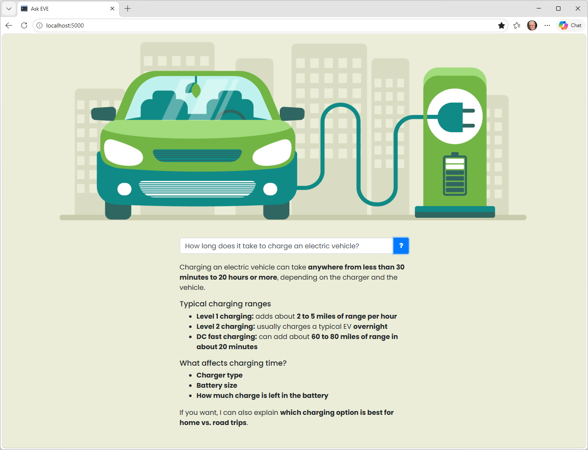
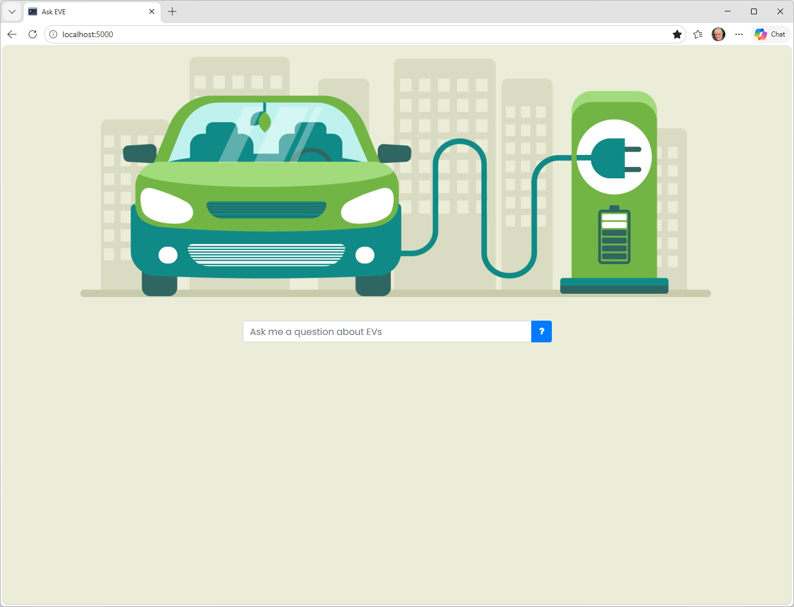

# Hands-on lab: Retrieval-Augmented Generation

The #1 use case for Large Language Models (LLMs) today is putting them over internal documents to make information in those documents easily discoverable. [Retrieval-Augmented Generation](https://arxiv.org/abs/2312.10997) (RAG) is a technique that allows LLMs to work with any number of documents of any size. LLMs limit how much text can be input to them in a single call. RAG involves dividing documents into "chunks" of (typically) a few hundred words each and generating an embedding vector for each chunk. To answer a question, you generate an embedding vector from the question, identify the *n* most similar embedding vectors, and provide the corresponding chunks of text to the LLM. To improve results, you can use a reranker to determine which chunks are the most relevant. Let's demonstrate by building a Web site that answers questions about electric vehicles (EVs) using a set of curated documents: three PDFs downloaded from government Web sites.



<a name="Exercise1"></a>
## Exercise 1: Build a vector database

A [vector database](https://en.wikipedia.org/wiki/Vector_database) is a key component of a RAG system. It stores chunks of text extracted from documents, embedding vectors generated from the text, and optional metadata. Moreover, you can pass an embedding vector in a query and retrieve the *n* most similar embedding vectors along with the text and metadata associated with them.

There are many vector databases available. [ChromaDB](https://www.trychroma.com/) is a free and open-source vector database that's fast, scales to millions of vectors, and is easily accessed from Python and JavaScript. In this exercise, you will create a ChromaDB database and seed it with chunks of content from three PDF files.

1. Install the following Python packages in your environment if they aren't installed already:

	- [openai](https://pypi.org/project/openai/) for calling OpenAI APIs
	- [chromadb](https://pypi.org/project/chromadb/) for working with ChromaDB databases
	- [sentence-transformers](https://pypi.org/project/sentence-transformers/) for reranking search results
	- [PyPDF](https://pypi.org/project/pypdf/) for extracting text from PDF files
	- [Flask](https://pypi.org/project/Flask/) for building Web sites
	- [DeepEval](https://pypi.org/project/deepeval/) for evaluating LLM output

1. Install [SQLite3](https://www.sqlite.org/download.html) on your computer if it isn't installed already. Chroma requires SQLite3 version 3.35 or higher.

	> The SQLite Web site is light on details for installing SQLite3. A better explanation can be found [here](https://www.tutorialspoint.com/sqlite/sqlite_installation.htm). If you're installing on 64-bit Windows, download the `win64` zip files rather than the `win32` zip files.

1. The resources that accompany this lab include a directory named "Documents" that contains three PDF files with information about electric vehicles. Navigate to that directory and create a text file named **create_knowledge_base.py**.

1. Open **create_knowledge_base.py** in your favorite code editor and paste in the following code:

	```python
	import chromadb, uuid
	from pypdf import PdfReader

	# Create a persistent ChromaDB database in the "chroma" subdirectory
	client = chromadb.PersistentClient('chroma')
	collection = client.create_collection(name='Electric_Vehicles')

	# How many words to take from neighboring pages
	OVERLAP_WORDS = 25

	# Extract text from the PDFs and add them to the database
	file_names = [
	    'electric_vehicles.pdf',
	    'pev_consumer_handbook.pdf',
	    'department-for-transport-ev-guide.pdf'
	]

	for file in file_names:
	    print(f'Processing {file}')
	    reader = PdfReader(file)

	    # Extract all pages up front so we can reference neighbors
	    pages = [page.extract_text() or '' for page in reader.pages]

	    for i, text in enumerate(pages):
	        # Take the last OVERLAP_WORDS words from the preceding page
	        prefix = ' '.join(pages[i - 1].split()[-OVERLAP_WORDS:]) if i > 0 else ''

	        # Take the first OVERLAP_WORDS words from the succeeding page
	        suffix = ' '.join(pages[i + 1].split()[:OVERLAP_WORDS]) if i < len(pages) - 1 else ''

	        chunk = f'{prefix} {text} {suffix}'.strip()

	        collection.add(
	            documents=[chunk],
	            metadatas=[{ 'file': file, 'page': i }],
	            ids=[uuid.uuid4().hex]
	        )
	```

	This Python script create a ChromaDB database in the "chroma" subdirectory, creates a collection named "Electric_Vehicles" in the database, and inserts pages extracted from the PDF files into the collection. (A collection in ChromaDB is analagous to a table in a relational database.) Each chunk comprises one page of content, plus 25 words from the page before and the page after. ChromaDB uses a built-in embeddings model to generate embedding vectors. That model is [`all-MiniLM-L6-v2`](https://huggingface.co/sentence-transformers/all-MiniLM-L6-v2), which generates vectors of 384 floating-point numbers for each text sample passed into it. You can configure it to use other embedding models if you'd like, including OpenAI's [`text-embedding-3-small`](https://developers.openai.com/api/docs/models/text-embedding-3-small) model. But `all-MiniLM-L6-v2` is sufficient for this lab, and best of all, it's free.

1. Run **create_knowledge_base.py**. Once it's finished, confirm that the "Documents" directory contains a subdirectory named "chroma." The files in that directory and its subdirectories comprise your vector database.

Now that the vector database is ready, the next step is to put it to work using Retrieval-Augmented Generation.

<a name="Exercise2"></a>
## Exercise 2: Use the vector database as a knowledge base

In this exercise, you'll build a Web site that answers questions about electric vehicles. The assets for the Web site are provided for you. You'll modify those assets to fetch chunks from the vector database and pass them to an LLM to use as context for answering questions.

1. Create a project directory in the location of your choice. Then copy all of the files and subdirectories in the "Flask" directory included with this lab to the project directory.

1. Take a moment to examine the files that you copied into the project directory. These files comprise a Web site written in Python and Flask. They include:

	- **app.py**, which holds the Python code that drives the site
	- **helpers.py**, which contains helper functions for streaming tool calls and stateful chats
	- **tools.py**, which contains a tool for answering questions about electric vehicles
	- **templates/index.html**, which contains the site's home page
	- **static/main.css**, which contains CSS to dress up the home page
	- **static/banner.jpg**, which contains the Web site's banner
	- **static/script.js**, which contains the JavaScript code used by the home page

	Currently, the `query_knowledge_base` function in **tools.py** returns one hard-coded paragraph of text about electric vehicles. Because the system prompt in **app.py** instructs the LLM to *only* answer questions using information returned by this tool, the app currently can't answer most questions. In a moment, you'll fix that by modifying `query_knowledge_base` to query the ChromaDB database.

1. Open a Command Prompt or terminal window and `cd` to the project directory. Then use the following command to make your OpenAI API key available through an environment variable if you're running Windows:

	```bash
	set OPENAI_API_KEY=key
	```

	Or use this command for Linux or macOS:

	```bash
	export OPENAI_API_KEY=key
	```

	In either case, replace *key* with your OpenAI API key.

1. . Use the following command to start Flask:

	```bash
	flask run --debug
	```

	Running Flask in debug mode is helpful when you're developing a Web site because Flask automatically reloads any files that change while the site is running. 

1. Open a browser and go to http://localhost:5000/. Confirm that the Web site appears in your browser:

	

1. Type "How long does it take to charge an electric vehicle?" into the text box in the center of the page. Then click the **?** button and confirm that the app can't answer the question because the tool that it calls doesn't consult the knowledge base.

1. Close your browser. Return to the Command Prompt or terminal window and stop Flask. Then copy the "chroma" directory that you created in the previous exercise to the project directory. This will make the vector database available to your Web site.

1. Open **tools.py** in your favorite code editor and add the following statements at the top of the file:

	```python
	import chromadb, os, logging
	from sentence_transformers import CrossEncoder

	# Suppress HuggingFace/transformers warnings
	os.environ['TOKENIZERS_PARALLELISM'] = 'false'
	logging.getLogger('sentence_transformers').setLevel(logging.ERROR)
	logging.getLogger('transformers').setLevel(logging.ERROR)

	# Load the vector database
	client = chromadb.PersistentClient('chroma')
	collection = client.get_collection(name='Electric_Vehicles')

	# Load a cross encoder for reranking
	reranker = CrossEncoder('cross-encoder/ms-marco-MiniLM-L-6-v2')
	```

	At startup, this code connects to the ChromaDB database, retrieves a reference to the "Electric_Vehicles" collection, and loads the [`ms-marco-MiniLM-L-6-v2`](https://huggingface.co/cross-encoder/ms-marco-MiniLM-L6-v2) reranker from Hugging Face. This reranker handles up to 512 tokens and is fast, even when run on CPU rather than GPU.

1. Replace the `query_knowledge_base` function with the following implementation:

	```python
	def query_knowledge_base(question: str) -> str:
	    try:
	        # Query the vector database for up to 10 chunks
	        print('\033[92mQuerying the knowledge base\033[0m')

	        results = collection.query(
	            query_texts=[question],
	            n_results=10
	        )

	        # Use the cross encoder to identify the 5 best matches and return them as context
	        print('\033[92mReranking the results\033[0m')
	        documents = results['documents'][0]
	        ranked_documents = reranker.rank(question, documents, return_documents=True, top_k=5)

	        # Combine the results into one string
	        return '\n\n'.join(x['text'] for x in ranked_documents)

	    except Exception as e:
	        return f'Query knowledge base failed ({e})'
	```

	This function retrieves up to 10 chunks from the ChromaDB database. Then it passes the chunks to the reranker and asks it for the five chunks that are most likely to contain an answer to the question. Finally, it combines the chunks into one string and returns that string to the caller.

1. Save your changes to **tools.py**. Then return to the Command Prompt or terminal window and use a `flask run --debug` command to start the application again. Point your browser to http://localhost:5000/ and ask "How long does it take to charge an electric vehicle?" Confirm that an answer appears underneath.

1. Test the app by submitting additional questions. Here are some questions to try:

	- How far can an EV go on a single charge?
	- Does regenerative braking cause brakes to wear out faster?
	- What are three good reasons to buy an electric vehicle?
	- Are EVs cheaper to maintain than conventional cars?
	- Will my EV explode if I take it through a car wash?

Finally, submit the question "How much does a Tesla Model Y cost?" and confirm that the app declines to answer. Left unbounded, an LLM might answer this question by drawing from the data it was trained with. Using RAG to put an LLM over a set of documents and instructing the LLM to answer "I don't know" if it can't answer the question from the context provided is an effective way to limit an LLM's propensity to hallucinate.

<a name="Exercise3"></a>
## Exercise 3: Evaluate the RAG pipeline with DeepEval

The app you built in [Exercise 2](#Exercise2) can answer questions, but so far the only way to check whether it's answering *correctly* is to type a question and eyeball the response. That doesn't scale, and it won't catch regressions if you later change the chunking strategy, the reranker, or the system prompt. In this exercise, you'll use [DeepEval](https://deepeval.com/), an open-source LLM evaluation framework, to score the pipeline automatically against a small set of questions with known-good answers.

DeepEval works like a testing framework for LLM output: you write test cases the way you'd write unit tests, and instead of asserting `x == y`, you assert that an LLM-graded metric clears a threshold. It uses an LLM (by default, an OpenAI model) as the judge, so each metric costs a small number of API calls — worth knowing before you run this against a large question set.

1. In **tools.py**, add a new function that returns the retrieved chunks as a list rather than a single combined string. DeepEval's retrieval-quality metrics need the individual chunks, not a flattened blob:

	```python
	# Helper function that retrieves and reranks chunks, returning them as a list
	def retrieve_chunks(question: str, n_results: int = 10, top_k: int = 5) -> list[str]:
	    results = collection.query(query_texts=[question], n_results=n_results)
	    documents = results['documents'][0]
	    ranked_documents = reranker.rank(question, documents, return_documents=True, top_k=top_k)
	    return [x['text'] for x in ranked_documents]
	```

	You can optionally simplify `query_knowledge_base` to call `retrieve_chunks` and join the results, so there's one retrieval code path instead of two.

1. Create a file named **golden_dataset.json** in your project directory and paste the following JSON into it. This is your "golden set:" a handful of questions paired with answers you'd expect a robust system to give.

	```json
	[
	  {
	    "question": "How long does it take to charge an electric vehicle?",
	    "expected_answer": "Charging time depends on the charger level and the vehicle's battery size. Level 1 (standard 120V outlet) can take a full day or more, Level 2 (240V) typically takes several hours, and DC fast charging can add significant range in around 20-40 minutes.",
	    "category": "in-scope"
	  },
	  {
	    "question": "How far can an EV go on a single charge?",
	    "expected_answer": "Most modern EVs offer a range of roughly 200 to 300 miles on a full charge, though this varies by model, battery size, driving conditions, and climate.",
	    "category": "in-scope"
	  },
	  {
	    "question": "Does regenerative braking cause brakes to wear out faster?",
	    "expected_answer": "No. Regenerative braking reduces reliance on the friction brakes, which typically means EV brake pads and rotors last longer than those on conventional vehicles.",
	    "category": "in-scope"
	  },
	  {
	    "question": "Are EVs cheaper to maintain than conventional cars?",
	    "expected_answer": "Generally yes. EVs have fewer moving parts (no oil changes, spark plugs, or exhaust systems) which tends to lower routine maintenance costs.",
	    "category": "in-scope"
	  },
	  {
	    "question": "Will my EV explode if I take it through a car wash?",
	    "expected_answer": "No. EV battery packs and electrical components are sealed and designed to be safe in wet conditions, including car washes.",
	    "category": "in-scope"
	  },
	  {
	    "question": "How much does a Tesla Model Y cost?",
	    "expected_answer": "I don't know.",
	    "category": "out-of-scope"
	  }
	]
	```

1. Create a file named **test_rag.py** in your project directory with the following content:

	```python
	import json
	import pytest
	from openai import OpenAI
	from deepeval import assert_test

	from deepeval.metrics import (
	    FaithfulnessMetric,
	    AnswerRelevancyMetric,
	    ContextualPrecisionMetric,
	    ContextualRecallMetric,
	)

	from deepeval.test_case import LLMTestCase
	from tools import retrieve_chunks

	client = OpenAI()

	SYSTEM_PROMPT = '''
	    You are Ask EVE, an assistant that answers questions about electric
	    vehicles. Only answer using the context provided below. If the answer
	    is not contained in the context, respond with exactly: I don't know.
	    '''

	with open('golden_dataset.json') as f:
	    GOLDEN_SET = json.load(f)

	faithfulness = FaithfulnessMetric(threshold=0.7, verbose_mode=False)
	answer_relevancy = AnswerRelevancyMetric(threshold=0.7, verbose_mode=False)
	contextual_precision = ContextualPrecisionMetric(threshold=0.6, verbose_mode=False)
	contextual_recall = ContextualRecallMetric(threshold=0.6, verbose_mode=False)

	def generate_answer(question, context):
	    context_block = '\n\n'.join(context)

	    response = client.chat.completions.create(
	        model='gpt-5.4-mini',
	        messages=[
	            { 'role': 'system', 'content': SYSTEM_PROMPT },
	            { 'role': 'user', 'content': f'Context:\n{context_block}\n\nQuestion: {question}' },
	        ],
	    )

	    return response.choices[0].message.content

	@pytest.mark.parametrize('item', GOLDEN_SET, ids=[i['question'] for i in GOLDEN_SET])
	def test_rag_pipeline(item):
	    retrieval_context = retrieve_chunks(item['question'])
	    actual_output = generate_answer(item['question'], retrieval_context)

	    test_case = LLMTestCase(
	        input=item['question'],
	        actual_output=actual_output,
	        expected_output=item['expected_answer'],
	        retrieval_context=retrieval_context,
	    )

	    assert_test(test_case, [faithfulness, answer_relevancy, contextual_precision, contextual_recall])
	```

	This test file checks each question in the golden set against four metrics:

	- **Faithfulness** -— Does the generated answer stick to what's actually in the retrieved chunks, or does it drift into unsupported claims (hallucination)?
	- **Answer Relevancy** -— Does the answer actually address the question that was asked?
	- **Contextual Precision** — Among the chunks retrieved, are the *relevant* ones ranked near the top? This is really a test of your reranker.
	- **Contextual Recall** — Did retrieval surface the chunks actually needed to answer the question? This is really a test of your chunking and embedding strategy.

1. Run the evaluation:

	```bash
	deepeval test run test_rag.py -- -q
	```

	DeepEval will churn for a minute or two and then print a pass/fail result and a score for each metric for each question. Note the questions that fail and which metric they fail on. That tells you *where* in the pipeline to look:

	- Low faithfulness with high contextual precision/recall usually points to the generation step or system prompt (the right context was there, but the model didn't stick to it).
	- Low contextual precision usually points to the reranker.
	- Low contextual recall usually points to chunking, overlap, or the embedding model.

	**test_rag.py** uses OpenAI's `GPT-5.4 mini` to judge LLM results, and at current rates, it costs about 60 cents to run the script. The DeepEval output lists the token cost. Data scientists often prefer to evaluate LLM output with a different LLM than the one generating it. As an experiment, you might try using a less expensive model (or even a non-OpenAI model) for the DeepEval work.

1. Try deliberately breaking something and re-running the eval to see the scores move. For example, reduce `OVERLAP_WORDS` to 0 in **create_knowledge_base.py** and rebuild the vector database, or reduce `top_k` in `retrieve_chunks` from 5 to 1. Confirm that contextual recall drops.

	> **A word of caution:** A passing score here means the answer is grounded in *whatever was retrieved*. It does not mean the retrieved content is itself correct or current. If the underlying PDFs were stale or wrong, faithfulness could still score well. Automated evaluation catches a specific, important class of errors (hallucination, poor retrieval ranking, off-topic answers); it's not a substitute for occasionally reading the source documents yourself.

	Conversely, you might be able to increase the scores by fetching more chunks from knowledge base. If you're curious, give it a try and use **test_rag.py** to quantify the results.

[Ragas](https://docs.ragas.io/) is a lighter-weight alternative built specifically for RAG evaluation, using the same underlying ideas (faithfulness, answer relevancy, context precision/recall) with less scaffolding. If you're interesting in learning more, install `ragas` and reproduce the same four scores using its API. Then compare the developer experience: DeepEval's pytest-style assertions and CI integration vs. Ragas's more dataset-driven, notebook-friendly workflow. Both are reasonable choices in production. DeepEval was used here because its `deepeval test run` model maps cleanly onto the "run your tests" mental model.
