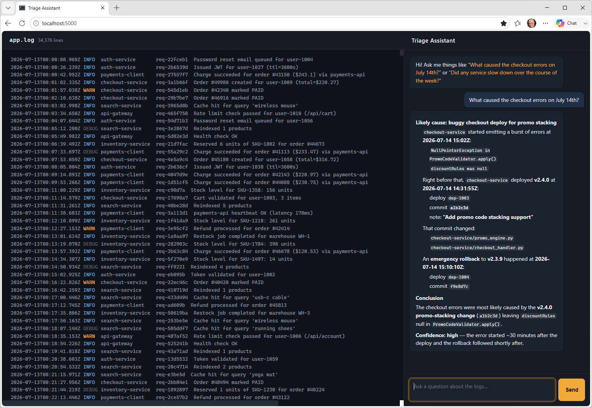

# Hands-on lab: Agentic AI

Traditional AI gave rise to generative AI, and generative AI is the bedrock of agentic AI. One of the greatest benefits of agentic AI is its ability to orchestrate complex workflows, freeing users from the tyranny of prescriptive UIs. Rather than manually poke around on an airline's Web site, for example, looking at all possible flights from point A to point B and counting empty first-class seats to increase your chance of being upgraded, it's now possible to build an agent that accepts a command such as "Find all the nonstop flights from Atlanta to New York on June 1st that cost less than $800 and show me the three with the most unsold seats in first class" — or just about any other command you could dream up, for that matter.

Suppose you're an engineer working for an e-commerce company. When something goes wrong, you have to diagnose and fix the problem quickly because every minute of downtime translates to lost revenue. You're also responsible for after-action reports identifying root causes and recommending future mitigations. The volume of data, however, is overwhelming. One file contains logs from the six microservices that comprise the platform. It grows by up to a megabyte every day. Two other log files provide the deployment history and commit metadata needed to trace each incident back to its root cause.

In this lab, you'll build an agentic application that uses these logs as the source of truth to help you analyze issues quickly. You'll start with a bare-bones agent that can do little more than guess about the nature of a problem. Then you'll add tools and skills that transform the agent into an IT superpower.



<a name="Exercise1"></a>
## Exercise 1: Prepare your environment and deploy the Web site

A starter Web site that uses the popular [Flask](https://flask.palletsprojects.com/en/2.3.x/) Web programming framework has been provided for you. In this exercise, you'll prepare your environment and get the Web site up and running.

1. Install the following Python packages in your environment if they aren't installed already:

	- [openai](https://pypi.org/project/openai/) for calling OpenAI APIs
	- [agno](https://pypi.org/project/agno/) for building AI agents
	- [Flask](https://pypi.org/project/Flask/) for building Web sites
	- [reportlab](https://pypi.org/project/reportlab/) for producing PDFs

1. Create a project directory in the location of your choice. Then copy all of the files and subdirectories in the "Flask" directory included with this lab to the project directory.

1. Take a moment to examine the files that you copied into the project directory. These files comprise a Web site written in Python and Flask. They include:

	- **app.py**, which responds to HTTP requests
	- **agents.py**, which implements a simple AI agent
	- **templates/index.html**, which contains the site's home page
	- **static/main.css**, which contains the CSS used to stylize the home page
	- **static/script.js**, which contains the JavaScript code used by the home page

	The "data" subdirectory contains three synthetic log files: **app.log**, **deploys.json**, and **commits.json**. Take a moment to examine these files and familiarize yourself with what's in them. The largest of the three by far is **app.log**, which contains more than 34,000 entries from July 13, 2026 through July 17, 2026.

1. Open a Command Prompt or terminal window and `cd` to the project directory. If you're running Windows, run the following commands to make your OpenAI API key available to the app (be sure to replace *key* with your OpenAI API key):

	```cmd
	set OPENAI_API_KEY=key
	```

	If you're running Linux or macOS, use these commands instead:

	```bash
	export OPENAI_API_KEY=key
	```

	In either case, replace *key* with your OpenAI API key.

1. Use the following command to start Flask:

	```bash
	flask run --debug
	```

1. Open a browser and go to http://localhost:5000/. Confirm that the Web site appears in your browser and that **app.log** is visible in the main body of the page.

1. Type "What caused the checkout errors on July 14th?" into the box at the bottom of the chat panel on the right and click the **Send** button (or simply press **Enter**). Confirm that an answer appears on the page.

Was the answer helpful? Probably not because the agent currently lacks access to the log files. Inside the log files is evidence of four "incidents." One occurred on July 14th. Can you determine what caused the checkout errors that day by manually browsing the log files? You probably can given enough time to do it, but what if the agent could do the same in mere seconds? The next step is to expand the agent's capabilities so it can access the log files and correlate the entries in each.

<a name="Exercise2"></a>
## Exercise 2: Add tools to give the agent access to the log files

A naive approach to making the log files available to the agent is to include the contents of all three in every request. But that's not practical. At 3.5 MB, **app.log** is too large to fit into the context windows of most LLMs. Even if you *could* pass the entire log file in every request, you wouldn't want to. One, it would increase cost. Two, it probably wouldn't produce the results you want. A documented phenomenon known as [context rot](https://www.trychroma.com/research/context-rot) means the more text you pass to an LLM, the less able it is to make sense of it. In addition, we now know that the self-attention mechanism used by LLMs pays [more attention to text at the beginning and end of the prompt](https://arxiv.org/abs/2307.03172) than to text in the middle.

The solution is to equip the agent with tools to extract just the parts of the log files that it needs. This is where thoughtful tool design comes in. In this exercise, you'll enhance the agent with four tools:

- `search_logs`, which retrieves log entries from **app.log** using pattern matching
- `get_deploys`, which returns deployment records from **deploys.json**
- `get_commit`, which returns a commit record from **commits.json**
- `compute_latency_stats`, which returns latency stats for the specified microservice

The fourth of these tools enables the agent to examine the logs for evidence of slowdowns — something it can't reliably do on its own since LLMs are notoriously bad at doing math.

1. Create a file named **tools.py** in the project directory and add the following statements to it:

	```python
	import re, json, statistics

	LOG_PATH = "data/app.log"
	DEPLOYS_PATH = "data/deploys.json"
	COMMITS_PATH = "data/commits.json"

	MAX_RESULTS = 200 # Max lines to return from app.log in a single tool call

	def _load_lines():
	    with open(LOG_PATH) as f:
	        return f.readlines()

	def _load_json(path):
	    with open(path) as f:
	        return json.load(f)

	# ISO-8601 timestamps (2026-07-14T14:32:05.034Z) sort correctly as plain
	# strings, so we can filter start/end with simple string comparison instead
	# of parsing datetimes on every line -- much faster over ~34k lines.
	def _in_range(ts, start, end):
	    if start and ts < start:
	        return False
	    if end and ts > end:
	        return False
	    return True
	```

1. Add the following function (tool) to **tools.py**.

	```python
	def search_logs(query: str = "", level: str = None, service: str = None,
	                start: str = None, end: str = None) -> str:
	    """
	    Search application logs for lines matching a text query.

	    Args:
	        query: Substring or regex to match against the log message
	            (case-insensitive). Optional -- omit or leave empty to match
	            every line, useful when filtering purely by level/service/date.
	        level: Optional exact filter, one of INFO, DEBUG, WARN, ERROR.
	        service: Optional exact filter, e.g. "checkout-service".
	        start: Optional ISO-8601 timestamp lower bound, e.g., "2026-07-14T14:00:00".
	        end: Optional ISO-8601 timestamp upper bound.

	    Returns:
	        Up to 200 matching log lines, newest first, plus a count of total
	        matches if truncated.
	    """

	    pattern = re.compile(query, re.IGNORECASE) if query else None
	    matches = []

	    for line in _load_lines():
	        ts = line[:24]  # timestamp is a fixed-width prefix
	        if level and f" {level:<5} " not in line:
	            continue
	        if service and f" {service:<18} " not in line:
	            continue
	        if not _in_range(ts, start, end):
	            continue
	        if pattern is None or pattern.search(line):
	            matches.append(line.rstrip())

	    total = len(matches)
	    matches = matches[-MAX_RESULTS:]
	    header = f"{total} matching lines" + (f" (showing most recent {MAX_RESULTS})" if total > MAX_RESULTS else "")
	    return header + "\n" + "\n".join(matches)
	```

	`search_logs` is the workhorse tool: it scans every line in **app.log** and returns the ones that match your filters. Notice that `query` is optional — the agent can call this tool with just `level="ERROR"` and `service="checkout-service"` to pull every error from one service, without needing a text pattern to search for. This matters because an LLM will sometimes want to filter without searching, and if `query` were required, that call would fail validation before it ever reached your code.

	The `level` and `service` filters use a slightly unusual trick: they check for the *exact padded string* (for example, `" ERROR "` with specific spacing) rather than a loose substring match. That's because every line in **app.log** was generated with level and service names padded to a fixed width, so this is a fast, precise way to filter without needing to parse each line into fields first.

	Finally, notice the `MAX_RESULTS` cap. Without it, a broad query against 34,000 lines could return thousands of matches and blow past what's practical to hand back to the model in one tool call — the same context-management problem you just read about, just showing up at the tool level instead of the prompt level. Capping the result set (and keeping the most *recent* matches, since those are usually most relevant to an active incident) keeps each tool call fast and keeps the agent's context lean.

1. Now add the `get_deploys` tool:

	```python
	def get_deploys(service: str = None, start: str = None, end: str = None) -> str:
	    """
	    Look up deploy history, optionally filtered by service and/or time window.

	    Args:
	        service: Optional exact service name filter, e.g. "checkout-service".
	        start: Optional ISO-8601 timestamp lower bound.
	        end: Optional ISO-8601 timestamp upper bound.

	    Returns:
	        JSON list of matching deploy records (deploy_id, timestamp, service,
	        version, commit, author, notes).
	    """

	    deploys = _load_json(DEPLOYS_PATH)
	    out = []

	    for d in deploys:
	        if service and d["service"] != service:
	            continue
	        if not _in_range(d["timestamp"], start, end):
	            continue
	        out.append(d)

	    return json.dumps(out, indent=2)
	```

	`get_deploys` answers a specific, recurring question during triage: "what changed right before this broke?" It filters the same way `search_logs` does (by service and time window), but instead of returning raw log text, it returns structured JSON straight from **deploys.json**. That distinction matters: a deploy record is small, well-defined data (an ID, a timestamp, a version, a commit SHA, an author, and notes), so handing the model clean JSON is more precise and less error-prone than reformatting it into prose first.

	This tool is also the first half of a two-step pattern the agent needs to learn: an error or crash in the logs is a symptom, not necessarily a root cause. The real cause is often a deploy that landed shortly before the symptom appeared. `get_deploys` surfaces *that* deployment — including its commit SHA — which sets up the next tool.

1. Add the `get_commit` tool:

	```python
	def get_commit(sha: str) -> str:
	    """
	    Look up a single commit by its SHA.

	    Args:
	        sha: The commit hash, e.g. "a1b2c3d" (as found in a deploy record).

	    Returns:
	        JSON commit record (sha, timestamp, author, message, files), or an
	        error message if not found.
	    """

	    commits = _load_json(COMMITS_PATH)

	    for c in commits:
	        if c["sha"] == sha:
	            return json.dumps(c, indent=2)

	    return f"No commit found with sha={sha}"
	```

	`get_commit` is the second half of that pattern. Unlike the other tools, it doesn't filter or search anything. Rather, it takes a commit SHA and returns one record. It's designed to be *chained* after `get_deploys`: the agent calls `get_deploys` to find the deployment near an incident, notices the commit SHA in that record, and then calls `get_commit` with that SHA to see what actually changed. That's the difference between an agent that stops at "a deployment happened around this time" and one that can tell you "this deployment added promo-code stacking, and the bug is in `promo_engine.py`."

1. Finally, add the `compute_latency_stats` tool:

	```python
	def compute_latency_stats(service: str, start: str = None, end: str = None) -> str:
	    """
	    Compute latency statistics (mean, p50, p95, max) for a service's logged
	    request/query durations over a time window. Use this instead of raw
	    search_logs when asked about performance trends, slowness, or degradation
	    over time -- grepping for WARN/ERROR won't surface a gradual latency
	    creep that never crosses an error threshold.

	    Args:
	        service: Service name, e.g. "search-service".
	        start: Optional ISO-8601 timestamp lower bound.
	        end: Optional ISO-8601 timestamp upper bound.

	    Returns:
	        JSON summary with sample count and latency stats in milliseconds,
	        plus first/last timestamp in the sample so trends can be reasoned
	        about across multiple calls (e.g. compare early-window vs late-window).
	    """

	    pattern = re.compile(r"in (\d+)ms")
	    samples = []

	    for line in _load_lines():
	        ts = line[:24]
	        if f" {service:<18} " not in line:
	            continue
	        if not _in_range(ts, start, end):
	            continue
	        m = pattern.search(line)
	        if m:
	            samples.append((ts, int(m.group(1))))

	    if not samples:
	        return json.dumps({"service": service, "count": 0, "note": "no timed samples found in range"})

	    values = [v for _, v in samples]
	    values_sorted = sorted(values)
	    p95_idx = int(len(values_sorted) * 0.95)

	    result = {
	        "service": service,
	        "count": len(values),
	        "first_timestamp": samples[0][0],
	        "last_timestamp": samples[-1][0],
	        "mean_ms": round(statistics.mean(values), 1),
	        "p50_ms": values_sorted[len(values_sorted) // 2],
	        "p95_ms": values_sorted[min(p95_idx, len(values_sorted) - 1)],
	        "max_ms": max(values),
	    }

	    return json.dumps(result, indent=2)
	```

	The first three tools all work the same way: they search or filter text and hand results back to the agent. `compute_latency_stats` is different. It does the math itself, in code, rather than leaving it to the agent. It pulls the numeric millisecond value out of every matching log line (using the `in (\d+)ms` pattern), then computes the mean, median (p50), 95th percentile (p95), and max using Python's `statistics` module.

	This matters because LLMs are unreliable at doing arithmetic over dozens or hundreds of scattered numbers by "reading" them out of text. They'll often eyeball a rough trend correctly but get the actual numbers wrong, especially the kind of percentile calculation needed here. By computing the stats deterministically and returning a clean JSON summary, this tool gives the agent a reliable way to answer questions like "has anything gotten slower?" — something `search_logs` can't answer well, since a gradual slowdown doesn't produce an ERROR or WARN line in **app.log**.

1. Open **agents.py** and add the following `import` at the top of the file to import the tools in **tools.py**:

	```python
	from tools import search_logs, get_deploys, get_commit, compute_latency_stats
	```

1. Replace the agent's existing system instructions with these:

	```python
	INSTRUCTIONS = """
	    You are an on-call incident triage assistant for an e-commerce platform.
	    Services: api-gateway, auth-service, checkout-service, inventory-service,
	    payments-client (wraps a third-party payments-api), search-service.

	    When asked why something broke or slowed down, don't stop at the first
	    error line you find -- check whether a deploy or commit around that time
	    could be the root cause, using get_deploys and get_commit.

	    For questions about performance, slowness, or trends over time, prefer
	    compute_latency_stats over raw search_logs -- a gradual degradation may
	    never produce an ERROR or WARN line you could grep for.

	    Cite specific timestamps, service names, and (when relevant) commit SHAs
	    in your answer so an engineer could verify your reasoning.

	    If the evidence doesn't clearly point to a single root cause, say so and
	    state your confidence rather than guessing.

	    Keep answers concise and skimmable -- this is a chat panel, not a report.
	    Use short paragraphs or a short bulleted list rather than long prose.
	    """

1. Add the following function to serve as a function hook. Connected to an agent, this hook prints tool calls to the host Command Prompt or terminal window. It's not required, but it does help you see what's happening behind the scenes:

	```python
	# Function to hook into tool calls
	def function_hook(function_name, function_call, arguments):
	    args_str = ", ".join(f"{k}={v!r}" for k, v in arguments.items())
	    print(f'\x1b[33mCalling {function_name}({args_str})\x1b[0m')
	    return function_call(**arguments)
	```

1. Modify the statement that creates an agent in the `create_agent` function as follows:

	```python
	agent = Agent(
	    model=OpenAIChat(id=MODEL),
	    session_id=session_id,
	    db=db,
	    add_history_to_context=True,
	    num_history_runs=12,
	    tools=[
	        search_logs,
	        get_deploys,
	        get_commit,
	        compute_latency_stats            
	    ],
	    tool_hooks=[function_hook],
	    instructions=INSTRUCTIONS,
	    markdown=True
	)
	```

	Observe that the modified agent has access to the tools you wrote.

Finish up by saving your changes to **tools.py** and **agents.py**. Now let's see if these tools give the agent visibility into the log files.

<a name="Exercise3"></a>
## Exercise 3: Test the results

With the tools wired up, the agent can now search **app.log**, pull deploy and commit histories, and compute latency statistics on demand. The real test is whether it uses them well: does it stop at the first error it finds, or does it chase the deploy and commit that actually caused it? Does it know to reach for `compute_latency_stats` instead of just searching for keywords when a question is about a trend rather than an error? The following steps walk through all four incidents present in the log files so you can see the difference tools make — *and* get a feel for where the agent's reasoning holds up and where it doesn't.

1. Return to http://localhost:5000 in your browser and refresh the page. If you stopped the app at the end of [Exercise 1](#Exercise1), simply start it again.

1. Ask the agent "What caused the checkout errors on July 14th?" again. Do you receive a richer response this time? Look in the host window where the app is running. What tools did the agent call?

1. A colleague informed you that the inventory service unexpectedly restarted on July 15th. Use the triage assistant to figure out what happened and why.

1. Your platform incurred rate limits accessing a third-party payment service on July 16th, resulting in potential payment failures. Management wants to know why and how the company is going to avoid this in the future. Can the agent help you run this down?

1. Ask the question "Did any service get slower over the course of the week, and if so, why?" This one requires the agent to reason quantitatively, not just search for keywords. Confirm that the agent concludes that a schema migration on July 15th caused search-service latency to climb steadily, from a baseline of ~45ms up to 150-200ms+ by the end of the log window on July 17th.

The core lesson of this lab isn't about log files. It's about the discipline of deciding what an agent should be able to do, and building tools narrow and reliable enough that the agent's judgment is the only uncertain part left. The same pattern — search, correlate, compute, chain — shows up anywhere an agent needs to reason over more data than fits gracefully in a prompt: support tickets, financial records, medical charts, code bases.

But there's a problem quietly growing in **agents.py**: `INSTRUCTIONS`. Every time you teach the agent more about what to do and how to do it — which tool to prefer for which kind of question, what the service topology looks like, how to recognize a recurring failure pattern — it goes into that same list, and every token in it is paid for and re-read on every single turn, whether or not it's relevant to the question being asked. The next exercise tackles that problem.

<a name="Exercise4"></a>
## Exercise 4: Package the agent's expertise as skills

Agno supports agent [skills](https://docs.agno.com/skills/overview) as a way of packaging instructions, reference documents, and helper scripts into self-contained folders that an agent browses, loads, and consults on demand. Instead of one `INSTRUCTIONS` list that has to anticipate every situation up front, each skill carries its own **SKILL.md** file with a short description. The agent sees only those descriptions until a request matches one, at which point it loads that skill's full instructions — and only that skill's instructions — into its context.

In this exercise, you'll extract the diagnostic judgment currently baked into `INSTRUCTIONS` into a `triage-diagnostics` skill. Then you'll add a brand-new `incident-report` skill that the agent reaches for only when asked to summarize or write up an incident — for example, "Generate an executive-level report of the incident with suggested remedial steps." You'll also give the agent the ability package incident reports in downloadable PDF files.

1. In the project directory, create the following folder structure:

	```
	skills/
	├── triage-diagnostics/
	│   ├── SKILL.md
	│   └── references/
	│       └── incident-patterns.md
	└── incident-report/
	    ├── SKILL.md
	    └── scripts/
	        └── render_report.py
	```

1. Create a file named **SKILL.md** in the "skills/triage-diagnostics" folder and add the following:

	```markdown
	---
	name: triage-diagnostics
	description: Diagnose incidents on the e-commerce platform by correlating log entries, deploys, and commits, and by computing latency trends. Use whenever the user asks what caused a problem, why something broke, or whether a service has been getting slower.
	---

	# Triage & Diagnostics
	Services: api-gateway, auth-service, checkout-service, inventory-service,
	payments-client (wraps a third-party payments-api), search-service.

	## Method

	1. Don't stop at the first error line you find. Check whether a deploy or
	   commit around that time could be the root cause, using `get_deploys`
	   and `get_commit`.
	2. For questions about performance, slowness, or trends over time, prefer
	   `compute_latency_stats` over raw `search_logs` -- a gradual degradation
	   may never produce an ERROR or WARN line you could grep for.
	3. Cite specific timestamps, service names, and (when relevant) commit
	   SHAs in your findings so an engineer could verify your reasoning.
	4. If the evidence doesn't clearly point to a single root cause, say so
	   and state your confidence rather than guessing.

	Keep chat answers concise and skimmable -- short paragraphs or a short
	bulleted list, not long prose.

	See `references/incident-patterns.md` for the failure signatures known to
	recur on this platform.
	```

	This is the same knowledge that's currently sitting in `INSTRUCTIONS`. You're not teaching the agent anything new, just moving it so it only gets loaded when it's relevant.

1. In the "skills/triage-diagnostics/references" folder, create the **incident-patterns.md** file referenced in **SKILL.md** and paste in the following text:

	```markdown
	# Known incident patterns
	- **Null-reference after deploy** -- a checkout or API error spikes
	  shortly after a deploy. Check get_deploys for anything in the
	  preceding hour and get_commit on the associated SHA.
	- **Memory leak / restart** -- a service unexpectedly restarts with no
	  single ERROR line explaining why. Look for a slow climb in latency or
	  a repeating WARN pattern in the hours before the restart, then trace
	  it back to the deploy that introduced it.
	- **Third-party rate limiting** -- a wrapper service (e.g.
	  payments-client) starts failing even though nothing on our side
	  changed. Check timestamps against known third-party outage or rate
	  limit windows, and recommend a mitigation such as backoff/retry or a
	  circuit breaker.
	- **Gradual latency creep** -- search_logs shows nothing wrong, but
	  compute_latency_stats reveals p95/p50 climbing steadily over days.
	  Look for a schema migration or config change near the start of the
	  climb.
	```

	This provides the agent with additional context for troubleshooting without preventing it from investigating other types of incidents as well.

1. Create **skills/incident-report/SKILL.md** and add the following:

	```markdown
	---
	name: incident-report
	description: Generate an executive-level incident report as a PDF, including a summary, root cause, impact, and suggested remedial steps. Use when the user asks for a report, write-up, summary, or postmortem of an incident -- for example, "generate an executive-level report of the incident with suggested remedial steps."
	---

	# Incident Report
	Executive reports are for people who weren't in the log files and won't
	read raw evidence. Base the report on findings already established in
	this conversation -- don't re-investigate from scratch unless nothing
	relevant has been discussed yet.

	Structure the report as:

	1. **Executive Summary** -- two or three sentences: what broke, for how
	   long, and the business impact.
	2. **Timeline** -- key timestamped events (deploy, commit, first error,
	   resolution if known).
	3. **Root Cause** -- one clear sentence naming the cause, followed by the
	   supporting evidence.
	4. **Impact** -- affected service(s), duration, and any quantifiable
	   effect (error counts, latency numbers) you can cite.
	5. **Recommended Remedial Steps** -- concrete, prioritized actions to
	   prevent recurrence. Not "monitor more closely" -- name the specific
	   guardrail, test, or process change.

	Keep it to one page. Avoid raw log lines and jargon a director wouldn't
	recognize.

	Once you've drafted the content, run render_report.py with a single JSON
	argument containing the five fields above (title, executive_summary,
	timeline, root_cause, impact, remedial_steps). Tell the user the report
	is ready and include a markdown link (/reports/<filename>) in your response.
	```

	Unlike `triage-diagnostics`, this skill ships executable code: when the agent decides it needs to render the PDF, it calls `get_skill_script("incident-report", "scripts/render_report.py")` instead of a tool you built. Scripts are the third way that a skill can extend an agent, along with instructions and references.

1. Create **render_report.py** in the "skills/incident-report/scripts" folder and add the following code:

	```python
	#!/usr/bin/env python3
	"""
	Render an executive incident report to a one-page PDF using reportlab.

	Usage:
	    python render_report.py '<json>'

	<json> is an object with the keys: title, executive_summary, timeline,
	root_cause, impact, remedial_steps. Prints {"pdf_path": "..."} on success,
	or {"error": "..."} on failure.
	"""
	import sys, os, json, uuid, traceback
	from datetime import datetime
	from xml.sax.saxutils import escape

	from reportlab.lib.pagesizes import LETTER
	from reportlab.lib.styles import getSampleStyleSheet, ParagraphStyle
	from reportlab.lib.units import inch
	from reportlab.platypus import SimpleDocTemplate, Paragraph, Spacer
	from reportlab.lib.enums import TA_LEFT

	# CWD when this script runs via get_skill_script is the skill's own
	# folder, not the project root -- so REPORTS_DIR can't be a plain
	# relative path. Anchor it to this file's location instead: four levels
	# up from skills/incident-report/scripts/ is the project root.
	_PROJECT_ROOT = os.path.dirname(os.path.dirname(os.path.dirname(os.path.dirname(os.path.abspath(__file__)))))
	REPORTS_DIR = os.path.join(_PROJECT_ROOT, "static", "reports")

	def _prep(text: str) -> str:
	    """
	    Paragraph text is a small XML-like markup (supports <b>, <br/>, etc.),
	    so literal &, <, > in report content must be escaped or they'll be
	    parsed as markup instead of displayed. Also convert real newlines to
	    <br/> so multi-line fields (e.g. a timeline with one event per line)
	    wrap as separate lines instead of running together.
	    """
	    if not isinstance(text, str):
	        text = str(text)
	    return escape(text).replace("\n", "<br/>")

	def build_report_pdf(report: dict) -> str:
	    """
	    Render an executive incident report dict to a one-page PDF and return
	    its path. Expects the keys title, executive_summary, timeline,
	    root_cause, impact, remedial_steps.
	    """
	    os.makedirs(REPORTS_DIR, exist_ok=True)
	    filename = f"incident-report-{uuid.uuid4().hex}.pdf"
	    path = os.path.join(REPORTS_DIR, filename)

	    styles = getSampleStyleSheet()
	    title_style = ParagraphStyle(
	        "ReportTitle", parent=styles["Title"], alignment=TA_LEFT, fontSize=18
	    )
	    meta_style = ParagraphStyle(
	        "Meta", parent=styles["Normal"], fontSize=9, textColor="#555555"
	    )
	    heading_style = ParagraphStyle(
	        "SectionHeading", parent=styles["Heading2"], spaceBefore=12, spaceAfter=4
	    )
	    body_style = ParagraphStyle(
	        "Body", parent=styles["BodyText"], fontSize=10, leading=14
	    )

	    doc = SimpleDocTemplate(
	        path,
	        pagesize=LETTER,
	        topMargin=0.75 * inch,
	        bottomMargin=0.75 * inch,
	        leftMargin=0.75 * inch,
	        rightMargin=0.75 * inch,
	    )

	    story = [
	        Paragraph(_prep(report.get("title", "Incident Report")), title_style),
	        Paragraph(datetime.now().strftime("Generated %Y-%m-%d %H:%M"), meta_style),
	        Spacer(1, 0.2 * inch),
	    ]

	    for heading, key in [
	        ("Executive Summary", "executive_summary"),
	        ("Timeline", "timeline"),
	        ("Root Cause", "root_cause"),
	        ("Impact", "impact"),
	        ("Recommended Remedial Steps", "remedial_steps"),
	    ]:
	        story.append(Paragraph(heading, heading_style))
	        story.append(Paragraph(_prep(report.get(key, "")), body_style))

	    doc.build(story)
	    return path

	def main():
	    if len(sys.argv) < 2:
	        print(json.dumps({"error": "expected one JSON argument"}))
	        sys.exit(1)

	    try:
	        report = json.loads(sys.argv[1])
	    except json.JSONDecodeError as e:
	        print(json.dumps({"error": f"invalid JSON argument: {e}"}))
	        sys.exit(1)

	    try:
	        path = build_report_pdf(report)
	    except Exception as e:
	        print(json.dumps({
	            "error": f"failed to render PDF: {e}",
	            "traceback": traceback.format_exc()
	        }))
	        sys.exit(1)

	    print(json.dumps({"filename": os.path.basename(path)}))

	if __name__ == "__main__":
	    main()
	```

	This is the script that the agent executes to generate a report. It uses the popular [reportlab](https://pypi.org/project/reportlab/) package to save the report as a PDF.

1. Open **agents.py** and update the imports at the top:

	```python
	from agno.skills import Skills, LocalSkills
	from tools import search_logs, get_deploys, get_commit, compute_latency_stats
	```

1. Replace `INSTRUCTIONS` with a much shorter version. The domain knowledge now lives in the skills, so all that's left here are base instructions:

	```python
	INSTRUCTIONS = """
	    You are an on-call incident assistant for an e-commerce platform.
	    Keep chat answers concise and skimmable. The incident-report skill
	    is the exception -- follow its structure instead.
	    """
	```

1. Modify the `Agent(...)` call in `create_agent` to make the agent aware of the "skills" directory:

	```python
	agent = Agent(
	    model=OpenAIChat(id=MODEL),
	    session_id=session_id,
	    db=db,
	    add_history_to_context=True,
	    num_history_runs=12,
	    tools=[
	        search_logs,
	        get_deploys,
	        get_commit,
	        compute_latency_stats
	    ],
	    skills=Skills(loaders=[LocalSkills("skills")]),
	    tool_hooks=[function_hook],
	    instructions=INSTRUCTIONS,
	    markdown=True
	)
	```

1. Find the following statement in **app.py**:

	```python
	from flask import Flask, render_template, request, Response, stream_with_context, send_from_directory
	```

	Replace it with these statements:

	```python
	from flask import (
	    Flask, render_template, request, Response, stream_with_context,
	    send_from_directory, send_file, abort
	)
	```

1. Add the following statement after the one that declares `DATA_DIR`:

	```python
	REPORTS_DIR = os.path.join(os.path.dirname(__file__), "static", "reports")
	```

	`REPORTS_DIR` refers to the app's "static/reports" directory. This is where PDFs generated by the agent will be stored. Note that PDFs are not automatically deleted. In a production application, you could rememdy this by performing a periodic sweep of the "reports" directory and deleting old reports.

1. Add the following REST endpoint to **app.py** for downloading generated PDFs:

	```python
	# REST method for downloading a generated PDF
	@app.route('/reports/<filename>', methods=['GET'])
	def download_report(filename):
	    safe_name = os.path.basename(filename)
	    path = os.path.join(REPORTS_DIR, safe_name)

	    if not os.path.isfile(path):
	        abort(404)

	    return send_file(
	        path,
	        mimetype='application/pdf',
	        as_attachment=True,
	        download_name=safe_name
	    )
	```

1. Save your changes and restart the app. Ask the agent "What caused the checkout errors on July 14th?" again. Check the host window — you should see the agent load the `triage-diagnostics` skill before it reaches for `search_logs`, `get_deploys`, and `get_commit`.

1. In the same conversation, ask the agent to generate an executive-level report of the incident with suggested remedial steps. Confirm that the agent loads the `incident-report` skill instead, and that it writes the report using what it already found rather than re-running its investigation. Also confirm that the agent's response contains a link for downloading the report. Click that link and review the report.

You now have one agent that quietly becomes a specialist in either diagnostics or executive communication depending on what's being asked of it, without `INSTRUCTIONS` growing to keep up. That's the skills pattern: one agent with several bodies of expertise that are loaded on demand.